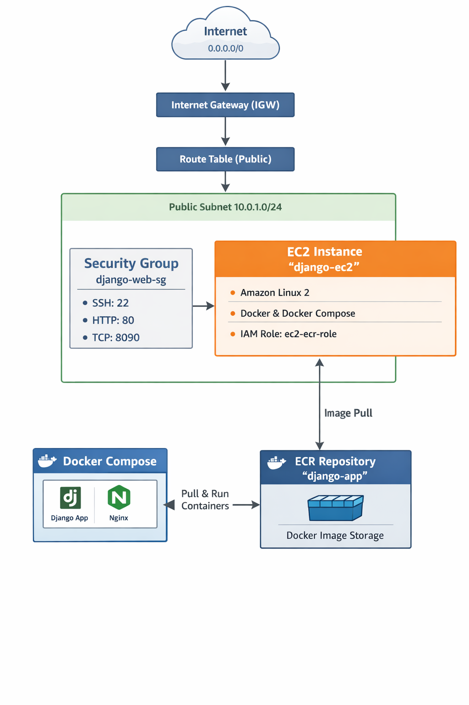

# Django AWS Deployment

Aplicación Django desplegada autom�ticamente en AWS usando Docker, Docker Compose y GitHub Actions. La infraestructura se gestiona con Terraform y el despliegue se realiza en instancias EC2 mediante CI/CD.

Nota:
Este proyecto está desplegado en una cuenta personal de AWS. Algunas decisiones (como no usar ALB + ACM) están orientadas a evitar costes recurrentes.
La arquitectura final debe incluye HTTPS, ALB, RDS y escalabilidad horizontal.
Tambien esta creados los despliegues con Helm Chart para tener la posibilidad de despeglarlo en Kubernetes

Django requiere un dominio válido para servir correctamente estáticos.
Al desplegar sobre una IP pública sin DNS, ALLOWED_HOSTS limita el acceso.
En un entorno real, se usará Route53 + dominio o S3.
 para probar http:<ip-publica-EC2>:8090

##  Descripción

Este proyecto implementa un sistema completo de despliegue automático para una aplicación Django (**boleto_enriquecido**) que incluye:

- **Frontend/Backend**: Django + Gunicorn
- **Base de Datos**: PostgreSQL 15
- **Web Server**: Nginx (proxy reverso)
- **Contenedorización**: Docker + Docker Compose
- **Infraestructura**: Terraform (AWS)
- **CI/CD**: GitHub Actions
- **Registro de Imágenes**: AWS ECR (Elastic Container Registry)
- **Instancias**: AWS EC2

##  Arquitectura



**Descripción del flujo:**
- **GitHub Repository**  Se hace push a rama main
- **GitHub Actions**  Compila Dockerfile y lo sube a AWS ECR
- **AWS ECR**  Registro privado de imágenes Docker
- **EC2 Instance**  Instancia donde corre docker-compose
  - Django (Gunicorn en puerto 9000)
  - PostgreSQL (Base de datos en puerto 5432)
  - Nginx (Proxy reverso en puerto 8090)
- **VPC + Security Groups**  Red privada y control de acceso (gestionado por Terraform)

Nota: se incluye un despligue manual(deploy-manual.yaml)

##  Requisitos Previos

### Local Development
- Docker & Docker Compose instalados
- Python 3.10+
- Git
- Terraform v1.14.5

### AWS
- Cuenta de AWS activa
- IAM User con permisos necesarios:
  - EC2 (crear/gestionar instancias)
  - ECR (crear/push imágenes)
  - VPC, Security Groups (gestión de red)
  - Terraform State (S3 si usas backend remoto)
- Par de claves SSH para EC2
- Access Key ID y Secret Access Key

### GitHub
- Repositorio público o privado
- Acceso para configurar secrets

##  Estructura del Proyecto

```
django-aws-deploy/
 Docker/                          # Aplicación Django
    Dockerfile                   # Multi-stage build
    docker-compose.yml           # Orquestación contenedores (local)
    entrypoint.sh               # Script de inicialización
    requirements.txt             # Dependencias Python
    ngingx.conf                 # Config de Nginx
    aws/
       compilar_docker_aws.sh  # Script para build y push a ECR
    boleto/                      # App Django principal
    boleto_enriquecido/          # Configuración Django
    manage.py
 .github/
    workflows/
        deploy.yaml              # Pipeline CI/CD
 terraform/                       # Infraestructura AWS
    provider.tf
    variables.tf
    vpc.tf
    ec2.tf
    ecr.tf
    security.tf
    roles.tf
    outputs.tf
    terraform.tfvars
 helm/                           # Despliegue opcional en Kubernetes
 README.md
```

Nota: se copia en la raiz del respositorio nginx.conf, docker-compose.yml, .env para facilitar el despliegue.

##  Configuración Inicial

### 1. Clonar el repositorio

```bash
git clone <your-repo-url>
cd django-aws-deploy
```

### 2. Configurar variables de Terraform

Edita `terraform/terraform.tfvars`:

```hcl
key_name = "tu-key-pair-name"
my_ip    = "203.0.113.0" --> No es necesario, ya que para que funcione la aplicacion se necesita apuntar 0.0.0.0/0(solo para la poc)
aws_region = "eu-west-1"
```

### 3. Crear archivo .env

```bash
DJANGO_SECRET_KEY=tu-django-secret-key-aqui
DEBUG=False
ALLOWED_HOSTS=localhost,127.0.0.1,tu-dominio.com

POSTGRES_DB=boleto_db
POSTGRES_USER=postgres
POSTGRES_PASSWORD=tu-contrase�a-fuerte

DJANGO_SUPERUSER_USERNAME=admin
DJANGO_SUPERUSER_EMAIL=admin@example.com
DJANGO_SUPERUSER_PASSWORD=admin-password-fuerte
```

##  Infraestructura con Terraform

### Instalar Terraform

- [Instalar Terraform](https://developer.hashicorp.com/terraform/tutorials/aws-get-started/install-cli)


### Desplegar infraestructura AWS

```bash
cd terraform/
terraform init
terraform plan
terraform apply
```

**Captura los outputs:**
```bash
terraform output ec2_public_ip
terraform output ecr_repository_url
```

##  Configurar GitHub Secrets

Ve a tu repositorio GitHub  **Settings**  **Secrets and variables**  **Actions** y agrega:

| Secret | Valor |
|--------|-------|
| AWS_ACCESS_KEY_ID | Tu AWS Access Key |
| AWS_SECRET_ACCESS_KEY | Tu AWS Secret Access Key |
| EC2_HOST | IP pública de la instancia (cambia cuando se redeploy) |
| EC2_SSH_KEY | Tu private SSH key (.pem content) |
| EC2_USER | ec2-user |

> ** Importante**: `EC2_HOST` necesita actualizarse cada vez que cambia la IP pública de la instancia.


##  Pipeline CI/CD (GitHub Actions)

El workflow automático se ejecuta en cada `push` a **main**:

### Flujo:
1. **Checkout** del repositorio
2. **Build** Dockerfile en multi-stage
3. **Push** imagen a AWS ECR
4. **Copia** docker-compose.yml, nginx.conf, .env a EC2
5. **SSH** a EC2 y ejecuta `docker-compose pull && docker-compose up -d`

### Archivo: `.github/workflows/deploy.yaml`

La configuración incluye:
- Build y push de imagen Docker a ECR
- Copia de archivos via SCP
- Conexión SSH a EC2 para despliegue
- Autenticación con GitHub Secrets

##  Variables de Entorno Requeridas

### GitHub Secrets (para CI/CD):
```
AWS_ACCESS_KEY_ID              AWS credentials
AWS_SECRET_ACCESS_KEY          AWS credentials
EC2_HOST                       IP pública de EC2 (actualizar cuando cambia)
EC2_SSH_KEY                    Private SSH key (.pem)
EC2_USER                       ec2-user
```

### .env local/EC2:
```
DJANGO_SECRET_KEY              Django secret
DEBUG                          False para producci�n
ALLOWED_HOSTS                  Dominios autorizados
POSTGRES_DB                    Nombre BD
POSTGRES_USER                  Usuario BD
POSTGRES_PASSWORD              Contraseña BD
DJANGO_SUPERUSER_*             Credenciales admin Django
```

##  Desplegar Manualmente

### Via GitHub Actions UI:
1. **Actions**  **CI/CD Docker to AWS**  **Run workflow**  **Run workflow**

### Via SSH a EC2:
```bash
ssh -i tu-key.pem ec2-user@<EC2_HOST>
cd /home/ec2-user/app/
aws ecr get-login-password --region eu-west-1 | docker login --username AWS --password-stdin 154712418645.dkr.ecr.eu-west-1.amazonaws.com
docker-compose pull
docker-compose up -d
```

##  Troubleshooting

### Workflow falla en "Deploy Docker Compose"
-  Verifica que `EC2_HOST` es la IP correcta: `terraform output ec2_public_ip`
-  Confirma que el Security Group permite SSH (puerto 22)
-  Valida que `EC2_SSH_KEY` es la private key correcta

### Contenedores no inician en EC2
```bash
ssh -i tu-key.pem ec2-user@<EC2_HOST>
docker-compose -f /home/ec2-user/app/docker-compose.yml logs -f
docker ps -a
```

### ECR Login falla
```bash
aws ecr get-login-password --region eu-west-1 | docker login --username AWS --password-stdin 154712418645.dkr.ecr.eu-west-1.amazonaws.com
```

### Espacio agotado en EC2
```bash
docker system prune -a
docker volume prune
```

##  Monitoreo

### Logs locales:
```bash
docker-compose logs -f web          # Django
docker-compose logs -f db           # PostgreSQL
docker-compose logs -f nginx        # Nginx
```

### Logs en EC2:
```bash
ssh -i tu-key.pem ec2-user@<EC2_HOST>
docker-compose -f /home/ec2-user/app/docker-compose.yml logs -f
```

##  Próximos Pasos

- [ ] Configurar HTTPS con certificado SSL
- [ ] Agregar AWS RDS para PostgreSQL
- [ ] Configurar S3 para estáticos
- [ ] Agregar CloudWatch para logs y monitoreo
- [ ] Implementar Load Balancer (ALB)
- [ ] Configurar backups automáticos
- [ ] Usar Kubernetes con Helm (charts listos en `/helm`)

##  Recursos

- [Django Documentation](https://docs.djangoproject.com/)
- [Docker Compose](https://docs.docker.com/compose/)
- [Terraform AWS Provider](https://registry.terraform.io/providers/hashicorp/aws/latest/docs)
- [GitHub Actions](https://docs.github.com/en/actions)
- [AWS ECR](https://docs.aws.amazon.com/ecr/)

##  Seguridad

-  Credenciales en GitHub Secrets
-  Multi-stage Docker build
-  Security Groups restrictivos
-  SSH key-based auth
-  Variables de ambiente protegidas

**Checklist pre-producci�n:**
- [ ] DJANGO_SECRET_KEY fuerte y único
- [ ] DEBUG=False
- [ ] ALLOWED_HOSTS con dominio real
- [ ] HTTPS en Nginx
- [ ] CSRF_TRUSTED_ORIGINS configurado
- [ ] Security Groups restrictivos
- [ ] Backups automáticos de BD

---